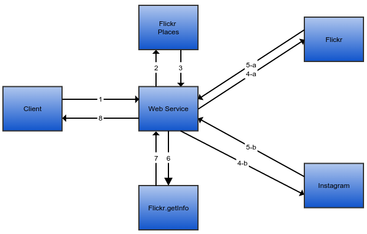

Service REST (Flickr & Instagram)
=============
### Description ###
Ce projet avait pour but de créer un service REST permettant d'interroger les Apis [Flickr](https://www.flickr.com/services/api/) et [Instagram](https://instagram.com/developer/)
afin de présenter les résultats (photos) sous une interface uniforme et ainsi s'abstraire de la représentation propre définie par chaque réseau social. Le service se limitait à la recherche
de photos selon leur géolocalisation.

### A noter ###
- MeanJS (MongoDB, Express, Angular, Node)
- Utilisation des modules [instagram-node](https://www.npmjs.com/package/instagram-node) et [flickrapi](https://www.npmjs.com/package/flickrapi) pour interroger les apis.
- Développement en annexe d'un client (AngularJS) afin d'interroger le service et de mettre en forme le résultat.
- Services :
	- Recherche des photos en fonction du lieu géographique : GET http://domaine/photos/place/{nomPays}/{nomRegion}/{nomVille}
	- Recherche des photos en fonction des coordonnées GPS : GET http://domaine/photos/coord/{latitude}/{longitude}
- Paramètres :
	- limit : nombre de photos désirées
	- sortBy : paramètre selon lequel le résultat doit être trié
	- sort : croissant ou decroissant
	- radius : rayon de recherche autour du point de coordonnées fourni (max 5km)
- Format de la réponse (json) :
	- "id": Identifiant de la ressource chez le fournisseur
	- "provider": Information sur le fournisseur
	- "latitude": Information sur la latitude
	- "longitude": Information sur la longitude de l’emplacement
	- "country": Information sur le pays
	- "region": Information sur la région
	- "city": Information sur la cité
	- "proximity": proximité de la photo avec le point de coordonnées sélectionné
	- "owner_id": Identifiant du propriétaire
	- "owner_name": Nom du propriétaire
	- "owner_profile_picture": "Photo du propriétaire de la ressource
	- "tags":  liste des tags de l’image
	- "type": type de la ressource
	- "url": url de l’image,
	- "date_created": date de création de la ressource en timestamp
	- "full_date_created": "date complète de création de l’image (YYYY-MM-DD HH24:MI:SSSS)
	- "title": Nom de l’image

### Architecture ###

- (2-3) Utilisation du services places de l'API Flickr afin d'associer un nom de lieu à ses coordonnées géographiques.
- (4-5) Interrogation des services de recherche de photos en fonction de coordonnées géographiques.
- (7-6) Enrichissement des métadonnées sur les photos Flickr dû au manque d'information retourné par le service à l'opération précédente.

Développé dans le cadre de l'UV MTI777 (Intelligence Artificielle) à l'ETS de Montréal.